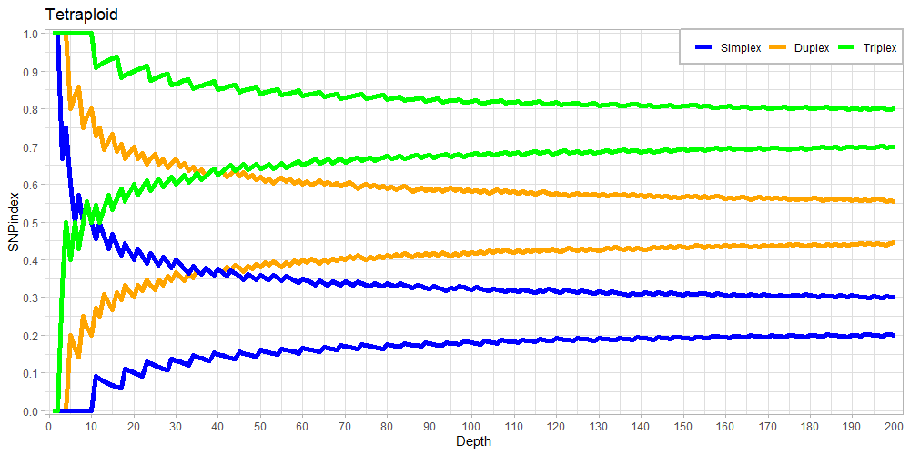
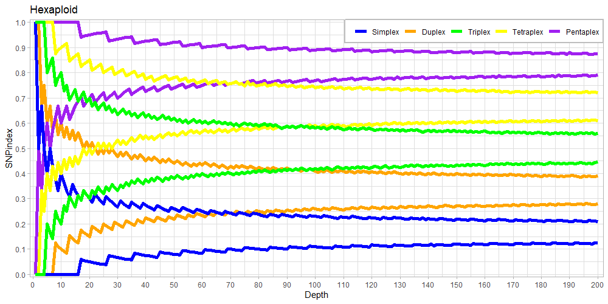
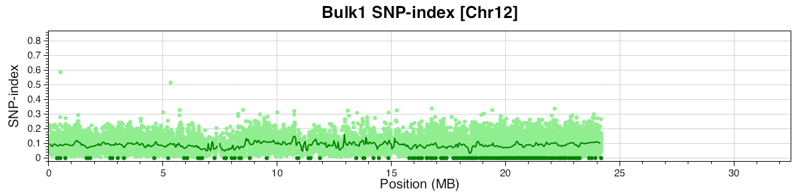
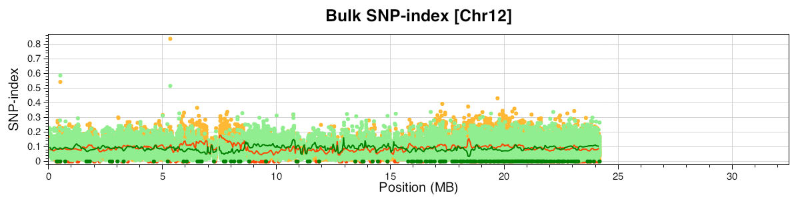
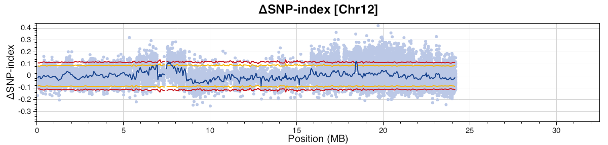
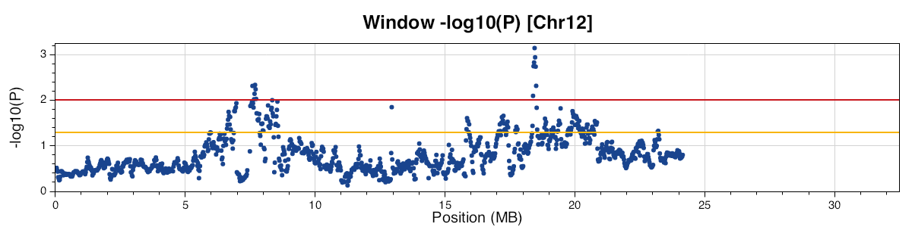
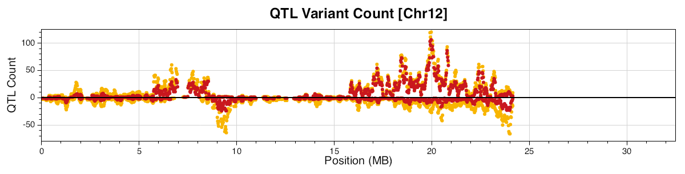

# What is PolyploidQtlSeq?
PolyploidQtlSeq is a program that extends [QTL-seq](https://github.com/YuSugihara/QTL-seq) (Takagi et al., 2013) for polyploid F1 populations. It uses two F1 population pools with extremely opposite traits and two parental varieties to detect QTLs.
In PolyploidQtlSeq, the population must be the F1 generation derived from a cross between Parent1 (P1) and Parent2 (P2), since it implements threshold calculation algorithms assuming F1 population.
By specifying ploidy of the species used and variant plexity utilized for the analysis, appropriate threshold is calculated based on the simulation test using a null distribution free from QTLs.
<br>

The main modifications are as follows:
- Supports polyploidy.
- Supports plexity-adapted simulation based on a F1 null distribution assuming free from QTLs to calculates P-value.
- Draws Bulk1 and Bulk2 SNP-index plots, and ΔSNP-index plot.
- Draws sliding window-averaged -log10(P) plot.
- Draws QTL-deduced variant counts per window plot.
- Appends annotation information by SnpEff.

## References
- Hiromoto Yamakawa, Masahiro Misumi, Yoshihiro Kawahara, Tatsumi Mizubayashi (2025) [Polyploid QTL-seq identified QTLs controlling fruit flesh color and flowering day in octoploid strawberry](https://doi.org/10.1270/jsbbr.24J11). Breeding Research (in Japanese)
- Hiromoto Yamakawa, Tatsumi Mizubayashi, Noriyuki Kitazawa, Utako Yamanouchi, Tsuyu Ando, Yoshiyuki Mukai, Etsuo Shimosaka, Takahiro Noda, Kenji Asano, Kotaro Akai, and Kenji Katayama (2024) [Polyploid QTL-seq identified QTLs controlling potato flesh color and tuber starch phosphorus content in a plexity-dependent manner. ](https://doi.org/10.1270/jsbbs.24028) Breed Sci:2024 Dec;74(5):403-414
- Hiromoto Yamakawa, Tatsumi Mizubayashi, Masaru Tanaka (2024) [Polyploid QTL-seq revealed multiple QTLs controlling steamed tuber texture and starch gelatinization temperature in sweetpotato.](https://doi.org/10.1270/jsbbs.23060). Breed. Sci. 74: 103-113.
- Hiromoto Yamakawa, Emdadul Haque, Masaru Tanaka, Hiroki Takagi, Kenji Asano, Etsuo Shimosaka, Kotaro Akai, Satoshi Okamoto, Kenji Katayama, Seiji Tamiya (2021) [Polyploid QTL-seq towards rapid development of tightly linked DNA markers for potato and sweetpotato breeding through whole-genome resequencing. ](https://doi.org/10.1111/pbi.13633) Plant Biotechnol J 19: 2040-2051. 
- Yu Sugihara, Lester Young, Hiroki Yaegashi, Satoshi Natsume, Daniel J. Shea, Hiroki Takagi, Helen Booker, Hideki Innan, Ryohei Terauchi, Akira Abe (2022) [High performance pipeline for MutMap and QTL-seq](https://peerj.com/articles/13170/). PeerJ 10: e13170.
- Hiroki Takagi, Akira Abe, Kentaro Yoshida, Shunichi Kosugi, Satoshi Natsume, Chikako Mitsuoka, Aiko Uemura, Hiroe Utsushi, Muluneh Tamiru, Shohei Takuno, Hideki Innan, Liliana M. Cano, Sophien Kamoun, Ryohei Terauchi (2013) [QTL-seq: rapid mapping of quantitative trait loci in rice by whole genome resequencing of DNA from two bulked populations](https://onlinelibrary.wiley.com/doi/10.1111/tpj.12105). Plant J. 74: 174-183.

# Installation
## Dependencies softwares
- dotnet (=8)
- fastp (>= 0.23)
- BWA
- Bcftools (>= 1.16)
- SAMtools (>= 1.16)
- SnpEff

## Installation using bioconda
PolyploidQtlSeq can be installed using bioconda.
<br>
It is recommended to create an environment to install PolyploidQtlSeq.

```
conda create -n polyQtlseq python=3
conda activate polyQtlseq
conda install -c bioconda poly-qtlseq
```

## Manual installation
It can also be installed manually.
<br>
It is recommended that an environment be created for manual installation as well.

```
conda create -n polyQtlseq python=3
conda activate polyQtlseq
```

Install required softwares.

```
conda install dotnet=8
conda install -c bioconda fastp=0.23
conda install -c bioconda bwa
conda install -c bioconda samtools=1.16
conda install -c bioconda bcftools=1.16
conda install -c bioconda snpeff
```
Dotnet may be installed using apt or other means. In that case, the following pinned file creation is not necessary.
Create a pinned file in the conda-meta directory to prevent dotnet upgraded to version 9 when the package is updated.

```
cd miniforge3/envs/polyQtlseq/conda-meta
echo dotnet=8 >> pinned
```
<br>

Click [Releases](https://github.com/TatsumiMizubayashi/PolyploidQtlSeq/releases) on the GitHub PolyploidQtlSeq page.
Download and extract the polyQtlseq-X.X.X.zip for the latest version.

Move the extracted file to the desired location and write the alias command in the .bashrc file.
```
alias polyQtlseq='dotnet /FULLPATH/PolyploidQtlSeq.dll'
```

# Preparation in advance
## Creation of index file for reference sequence
An index file for the reference sequence must be created for mapping.

```
bwa index -a bwtsw REF_SEQ.fa
samtools faidx REF_SEQ.fa
```

## SnpEff database preparation
If you wish to annotate using SnpEff, you must prepare a SnpEff database.
Please refer to the SnpEff manual for how to prepare the SnpEff database.

# Quality control
This is a subcommand for controlling the quality of Fastq files. fastp is used for the quality control.
|Short|Long|Default|Function|
|:---|:---|---:|:---|
|-i|--inputDir| |Raw Fastq directory.|
|-o|--outputDir| |Output directory.|
|-l|--lengthRequired|50|Minimum read length after trimming.|
|-n|--nBaseLimit|5|Maximum number of N bases.|
|-q|--quality|15|Threshold for base quality.|
|-Q|--cutTailMeanQuality|20|Threshold of average quality for trimming at 3' end.|
|-W|--cutTailWindowSize|1|Window size when trimmed at 3' end.|
|-t|--thread|10|Number of threads to use. Up to 16.|
|-P|--paramsFile| |Parameter file.|
|-h|--help| |Show help message.|

Locate raw Fastq files in a single directory as follows.
Fastq file extension should be fq.gz or fastq.gz. Single-end files are not supported.

```
P1_1.fq.gz          P1_2.fq.gz
P2_1.fq.gz          P2_2.fq.gz
Bulk1_1.fastq.gz    Bulk1_2.fastq.gz
Bulk2_1.fastq.gz    Bulk2_2.fastq.gz
```

Execute the polyQtlseq qc command for quality control.

```
polyQtlseq qc -i RawFastq -o QcFastq
```

Pair-end files are estimated based on the file names. Quality-controlled fastq files are saved in the directory specified by the -o argument.

# PolyploidQtlSeq pipeline
PolyploidQtlSeq pipeline performs mapping and subsequent variant detection for four samples of P1, P2, Bulk1, and Bulk2, and QTL-seq analysis.
Locate the quality-controlled Fastq files in the respective directories for P1, P2, Bulk1, and Bulk2, and execute the command.
If BAM files exist in P1, P2, Bulk1 and Bulk2 directories, the mapping process is skipped.

|Short|Long|Default|Function|
|:---|:---|---:|:---|
|-r|--refSeq| |Reference sequence file.|
|-p1|--parent1| |Parent1 directory.|
|-p2|--parent2| |Parent2 directory.|
|-b1|--bulk1| |Bulk1 directory.|
|-b2|--bulk2| |Bulk2 directory.|
|-cs|--chrSize|10,000,000|Threshold for length of chromosomes to be analyzed. Chromosomes with a length more than this value are analyzed.|
|-cn|--chrNames| |Specify the chromosome name to be analyzed. If there are more than one, separate them with commas. |
|-q|--minMQ|40|Minimum mapping quality at variant detection in bcftools mpileup.|
|-Q|--minBQ|13|Minimum base quality at variant detection in bcftools mpileup.|
|-C|--adjustMQ|60|Value for adjust mapping quality at variant detection in bcftools mpileup. Specify 0, to disable this function.|
|-sm|--snpEffMaxHeap|6|SnpEff maximum heap size (GB).|
|-sc|--snpEffConfig| |snpEff.config file. Not required if snpEff default config file is used.|
|-sd|--snpEffDatabase| |SnpEff database name.|
|-o|--outputDir| |Output directory.|
|-p1r|--p1MaxAlleleRate|0.99|Most allele frequency for Parent1. Variants exceeding this threshold is considered homozygous.|
|-p2r|--p2SnpIndexRange|0.15-0.375|SNP-index range for Parent2.|
|-md|--minDepth|40|Minimum Depth threshold. The variants with even one sample below this threshold are excluded for QTL analysis.|
|-mb|--maxBulkSnpIndex|1.0|Maximum threshold for SNP-index value for the Bulk samples. Variants with a SNP-index exceeding this value are excluded.|
|-p|--ploidy|4|Ploidy.|
|-np|--NPlex|1|Plexity of Parent2 used for QTL analysis.|
|-n1|--NBulk1|20|Number of individuals in Bulk1.|
|-n2|--NBulk2|20|Number of individuals in Bulk2.|
|-N|--NRep|5,000|Number of simulation replicates to generate a null distribution which is free from QTLs.|
|-w|--window|100|Window size (kbp) of the sliding window analysis.|
|-s|--step|20|Step size (kbp) of the sliding window analysis.|
|-fw|--figWidth|1,600|Width (pixel) of the graph images.|
|-fh|--figHeight|400|Height (pixel) of the graph images.|
|-xs|--xStep|5|X-axis scale interval (Mbp) of the graphs.|
|-di|--displayImpacts|HIGH,MODERATE|Annotation Impact to be included in the SNP-index file. Separate multiple items with commas.|
|-t|--thread|20|Number of threads to use.|
|-P|--paramsFile| |Parameter files.|
|-h|--help| |Show help message.|

Locate the quality-controlled Fastq files in the respective directories for P1, P2, Bulk1, and Bulk2.
<br>
e.g., P1 directory

```
P1_1.fq.gz    P1_2.fq.gz
```

Multiple pairs of Fastq files are acceptable for one sample, as follows.

```
P1-1_1.fq.gz    P1-1_2.fq.gz	
P1-2_1.fq.gz    P1-2_2.fq.gz	
```

After arrangement of Fastq files, execute the polyQtlseq command.

```
polyQtlseq -r refSeq.fa -p1 P1 -p2 P2 -b1 Bulk1 -b2 Bulk2 -n1 20 -n2 20 -o Results \
-p 4 -np 1 -md 40 -p2r 0.15-0.375 
```

The values for the p2r and md arguments should be determined by referring to the N-Plex SNP index simulation (See [N-Plex SNP index Simulation](#n-plex-snp-index-simulation)).

## Bcftools mpileup arguments
The minMQ(q), minBQ(Q), and adjustMQ(C) are arguments specified for the bcftools mpileup command. 
MinBQ is the threshold quality value of the base to be counted for depth. Note that setting high values of minBQ will result in a lower depth.
The adjustMQ(C) argument reduces the MQ in the variant-rich region. 
A lower value for the adjustMQ(C) argument lowers the MQ and excludes reads below the value of the minMQ(q) argument.
If 0 is specified for the adjustMQ(C) argument, MQ is not adjusted.For samples with many variants (e.g., hexaploid sweet potato), the number of variants used for analysis rises by increasing the value of adjustMQ(C) (e.g., 70) and decreasing the value of minMQ(q) (e.g., 30).

# PolyploidQtlSeq analysis
This is a subcommand that performs QTL-seq analysis based on a VCF file.
<br>
The VCF files must meet all the following conditions: 
- Listed in the order of Parent1, Parent2, Bulk1, and Bulk2.
- Include GT and AD values.

|Short|Long|Default|Function|
|:---|:---|---:|:---|
|-i|--inputVcf| |Input VCF file.|
|-o|--outputDir| |Output directory.|
|-p1r|--p1MaxAlleleRate|0.99|Most allele frequency for Parent1. Variants exceeding this threshold is considered homozygous.|
|-p2r|--p2SnpIndexRange|0.15-0.375|SNP-index range for Parent2.|
|-md|--minDepth|40|Minimum Depth threshold. The variants with even one sample below this threshold are excluded for QTL analysis.|
|-mb|--maxBulkSnpIndex|1.0|Maximum threshold for SNP-index value for the Bulk samples. Variants with a SNP-index exceeding this value are excluded.|
|-p|--ploidy|4|Ploidy.|
|-np|--NPlex|1|Specify the plexity of Parent2 used for QTL analysis.|
|-n1|--NBulk1|20|Number of individuals in Bulk1.|
|-n2|--NBulk2|20|Number of individuals in Bulk2.|
|-N|--NRep|5,000|Number of simulation replicates to generate a null distribution which is free from QTLs.|
|-w|--window|100|Window size (kbp) of the sliding window analysis.|
|-s|--step|20|Step size (kbp) of the sliding window analysis.|
|-fw|--figWidth|1,600|Width (pixel) of the graph images.|
|-fh|--figHeight|400|Height (pixel) of the graph images.|
|-xs|--xStep|5|X-axis scale interval (Mbp) of the graphs.|
|-di|--displayImpacts|HIGH,MODERATE|Annotation Impact to be included in the SNP-index file. Separate multiple items with commas.|
|-t|--thread|20|Number of threads to use.|
|-P|--paramsFile| |Parameter files.|
|-h|--help| |Show help message.|

```
polyQtlseq qtl -i qtlseq.vcf.gz -o Results -n1 20 -n2 20 \
-p 4 -np 1 -md 40 -p2r 0.15-0.375 
```

The values for the p2r and md arguments should be determined by referring to the N-Plex SNP index simulation (See [N-Plex SNP index Simulation](#n-plex-snp-index-simulation)).

# N-Plex SNP index Simulation
The value of the p2SnpIndexRange(p2r) and minDepth(md) arguments should be determined by referring to the following N-Plex SNP index simulation.

## Tetraploid

[Tetraploid graph data file](Data/Tetraploid.txt)

By increasing depths, SNP-index of simplex, duplex, and triplex are converged to 0.25, 0.50, and 0.75, respectively. Ninety percent of N-plex simulated population are included between two same color lines. Therefore, setting of -md 40 and -p2r 0.15-0.375 allows extraction of simplex.

## Hexaploid

[Hexaploid graph data file](Data/Hexaploid.txt)

By increasing depths, SNP-index of simplex, duplex, triplex, tetraplex, and pentaplex are converged to 0.17, 0.33, 0.50, 0.66, and 0.83, respectively. Ninety percent of N-plex simulated population are included between two same color lines. Therefore, setting of -md 70 and -p2r 0.10-0.24 allows extraction of simplex.

## Examples of setting
|Ploidy (p)|Nplex (np)|minDepth (md)|P2SnpIndexRange (p2r)|
|:---:|:---:|:---:|:---:|
|4|1 (Simplex)|40|0.15-0.375|
|4|1 (Simplex)|50|0.16-0.36|
|4|2 (Duplex)|50|0.38-0.62|
|6|1 (Simplex)|50|0.08-0.26|
|6|2 (Duplex)|50|0.22-0.44|

# Parameter file
Multiple arguments can be specified together by using a parameter file.
The parameter file is a text file that lists the arguments (either Short or Long) and their values in tab-delimited format. 
<br>
The format is as follows:

```
n1	20
n2	20
ploidy	4
NPlex	1
```

If an argument value is specified in both the parameter file and on the command line, the value specified on the command line is used.

# Output files
When the PolyploidQtlSeq pipeline completes, the following files are generated in the output directory.
- VCF file
- SNP-index.txt
- SlidingWindow.txt
- Graph image (per chromosome)
- Parameter file
- Log file

## SNP-index.txt
Information of all variants used in QTL-Seq analysis is described. When annotation with SnpEff is performed, annotation information is added at the end. 
- **Chr** : Chromosome name.
- **Position** : Location in chromosome (Start position).
- **Ref Allele** : Reference base.
- **P1 Allele** : Parent1 base.
- **Bulk1 Allele** : Bulk1 base.
- **Bulk2 Allele** : Bulk2 base.
- **Window P99** : Indicates whether the variant is included in the window deduced as QTL under the P99 condition.
- **Window P95** : Indicate whether the variant is included in the window deduced as QTL under the P95 condition.
- **P99** : Indicates whether the variant is deduced as QTL under the P99 condition.
- **P95** : Indicates whether the variant is deduced as QTL under the P95 condition.
- **Bulk1 Depth** : Total read count of Bulk1.
- **Bulk2 Depth** : Total read count of Bulk2.
- **P99 Threshold** : 99% confidence interval of ΔSNP-index calculated from the QTL-free null simulated distribution.
- **P95 Threshold** : 95% confidence interval of ΔSNP-index calculated from the QTL-free null simulated distribution.
- **Bulk1 SNP-index** : SNP-index of Bulk1.
- **Bulk2 SNP-index** : SNP-index of Bulk2.
- **Delta SNP-index** : subtracted SNP-index (Bulk2 – Bulk1).
- **P-value** : P-value calculated from the QTL-free null simulated distribution. 
- **-log10(P)** : logarithm of the P-value multiplied by -1.
- **Window P-value** : Minimum P-value among sliding windows where the variant resides.
- **Window -log10(P)** : logarithm of the Window P-value multiplied by -1.
- **Impact** : Value of the impact of the SnpEff annotation (in case that SnpEff was performed).
- **Annotation** : Annotation value of the SnpEff annotation (in case that SnpEff was performed).
- **HGVS.c** : Value of HGVS.c of the SnpEff annotation (in case that SnpEff was performed).
- **HGVS.p** : Value of HGVS.p of the SnpEff annotation (in case that SnpEff was performed). If amino acid substitution has not occurred, it will be blank (in case that SnpEff was performed).

## SlidingWindow.txt
All Sliding window information is included.
- **Chr** : Chromosome name.
- **Start** : Start position of window.
- **End** : End position of window.
- **Center** : Central position of window.
- **P99** : Indicates whether the window is deduced as QTL under the P99 condition.
- **P95** : Indicates whether the window is deduced as QTL under the P95 condition.
- **Variant count** : Number of variants within the window. 
- **P99 QTL variant count** : Number of variants deduced as QTL under the P99 condition in the window. 
- **P99 +Delta SNP-index QTL variant count** : Number of QTL variants with positive ΔSNP-index by the P99 criteria.
- **P99 -Delta SNP-index QTL variant count** : Number of QTL variants with negative ΔSNP-index by the P99 criteria.
- **P99 QTL variant rate** : Ratio of number of P99 QTL variants to that of all variants in the window.
- **P95 QTL variant count** : Number of variants deduced as QTL under the P95 condition in the window. 
- **P95 +Delta SNP-index QTL variant count** : Number of QTL variants with positive ΔSNP-index by the P95 criteria.
- **P95 -Delta SNP-index QTL variant count** : Number of QTL variants with negative ΔSNP-index by the P95 criteria.
- **P95 QTL variant rate** : Ratio of number of P95 QTL variants to that of all variants in the window.
- **Mean P99 threshold** : Mean of P99 thresholds of the variants within the window.
- **Mean P95 threshold** : Mean of P95 thresholds of the variants within the window.
- **Mean Bulk1 SNP-index** : Mean of bulk1 SNP-index for all variants in the window.
- **Mean Bulk2 SNP-index** : Mean of bulk2 SNP-index for all variants in the window.
- **Mean Delta SNP-index** : Mean of ΔSNP-index for all variants in the window.
- **Mean P-value** : Mean of P value for all variants in the window.
- **Mean-log10(P)** : Mean of -log10(P) for all variants in the window.
- **Bulk1 SNP-index=0 variant count** : Number of variants with Bulk1 SNP-index of 0.
- **Bulk2 SNP-index=0 variant count** : Number of variants with Bulk2 SNP-index of 0.

## Graphs
Graph images are generated for each chromosome, with six different graphs arranged vertically.
The X axis of the graph is adjusted to the size of the largest chromosome.
The Y axis of the graph is fitted to the minimum and maximum values of all data.
The scales of X and Y axes are the same for graphs of all chromosomes.

### Bulk1 SNP-index plot

- **Light green dots** : SNP-index of each variant.
- **Dark green dots** : Variants with SNP-index of 0.
- **Dark green line** : Sliding window mean of SNP-index.

### Bulk2 SNP-index plot

- **Light orange dots** : SNP-index of each variant.
- **Dark orange dots** : Variants with SNP-index of 0.
- **Dark orange line** : Sliding window mean of SNP-index.

### Bulk SNP-index plot
Graph of SNP-index plot of Bulk1 superimposed on that of Bulk2.

- **Light green dots** : Bulk1 SNP-index of each variant.
- **Dark green dots** : Variants with Bulk1 SNP-index of 0.
- **Dark green line** : Sliding window mean of Bulk1 SNP-index.
- **Light orange dots** : Bulk2 SNP-index of each variant.
- **Dark orange dots** : Variants with Bulk2 SNP-index of 0.
- **Dark orange line** : Sliding window mean of Bulk2 SNP-index.

### ΔSNP-index plot

- **Light blue dots** : ΔSNP-index of each variant.
- **Dark blue line** : Sliding window mean of ΔSNP-index (Bulk2 – Bulk1).
- **Red line** : Sliding window mean of P99 thresholds.
- **Yellow line** : Sliding window mean of P95 thresholds.

### Window -log10(P) plot
Graph plotting window-averaged -log10(P). 

- **Blue dot** : Sliding window mean of -log10(P)
- **Red line**: P99 threshold.
- **Yellow line** : P95 threshold.

### QTL variant count plot
Graph plotting the number of QTL-deduced variants in the sliding window. In order to divide variants by the direction of effect of QTLs, those with positive and negative ΔSNP-index values are plotted upward and downward, respectively.

- **Red dot** : Number of variants deduced as QTL by the P99 criteria.
- **Yellow dot** : Number of variants deduced as QTL by the P95 criteria.

## Parameter file
The settings for the executed command are saved as a parameter file.

# Description of analysis method

## Mapping
Mapping is conducted using bwa and samtools with the following command: 
```
bwa mem -t THREAD -M -R READ_GROUP REF_SEQ FASTQ1 FASTQ2 \
| samtools fixmate -m - - \
| samtools sort -@ THREAD \
| samtools markdup -r - - \
| samtools view -b -f 2 -F 2048 -o BAM_FILE
```

The READ_GROUP is created using the common part of the Fastq file name (BASE_NAME) and the sample name (SAMPLE_NAME) as follows: 
```
@RG\tID:BASENAME\tSM:SAMPLE_NAME\tPL:illumine\tLB:BASE_NAME_library
```

In case of multiple pairs of Fastq files, the BAM files are generated by the above processes, and then merged with the following command:

```
samtools merge MERGE_BAM INPUT_BAMS
```

## Variant call
Variant call is conducted using bcftools with the following command: 

```
bcftools mpileup -a AD,ADF,ADR -B -q MIN_MQ -Q MIN_BQ -C ADJUST_MQ \
-f REF_SEQ -d 10000 -r CHR_NAME -O u P1BAM P2BAM BULK1BAM BULK2BAM \
| bcftools call -v -m -a GQ,GP -O u \
| bcftools filter -i ‘INFO/MQ>=MIN_MQ’ -O u \
| bcftools norm -f REF_SEQ -O u \
| bcftools sort -O z -o VCF_FILE
```

Variant call is performed separately for each chromosome by parallel processing.
Then, the VCF files of all chromosomes are merged.

```
bcftools concat -O z -o MERGE_VCF INPUT_VCF1 INPUT_VCF2 ...
```

Annotations are attached using SnpEff with the following command.

```
snpEff -c SNPEFF_CONFIG_FILE DATABASE_NAME VCF_FILE -noStats
```

## Extraction of analyzable variants
QTL-seq analysis requires calculation of SNP-index. Variants must meet all the following conditions. 
- Parent1 is homozygous (judged by the GT value). 
- Variants consist of two types of alleles.
- Depths of all samples are one or more.

Variants that meet all these conditions are extracted and used for QTL-seq analysis.

## Calculation of SNP-index
SNP-index is calculated by the following formula: 
```
SNP-index = Number_of_reads_of_P2-type_allele / Depth
```

<br>
The P2-type allele is estimated using the GT value of P1.
If the GT value of P1 is 0/0 (Ref homozygous), the P2 allele is 1 (Alt allele).
If the GT value of P1 is 1/1 (Alt homozygous), the P2 allele is 0 (Ref allele).
If two Alt type alleles (Alt1 and Alt2) are detected without Ref type reads detected, the SNP-index is calculated. In this case, GT values of P1 and P2 are 1/1 and 2/2, respectively.

## Extraction of variants used for QTL-seq analysis
Variants that meet all the following conditions are extracted for PolyploidQtlSeq analysis. 
- Allele frequency of P1 is more than or equal to the threshold value specified as P1 maximum allele frequency.
- SNP-index of P2 is within the specified range. 
- Depth of all samples is more than or equal to the specified threshold.

## P1 most allele frequency
This filter is used to extract variants where P1 is homozygous. Since the bcftools used in PolyploidQtlSeq is originally created for diploid genome, it is optimized for diploid samples. Therefore, some AD value (Ref reads, Alt reads) from heterozygous segregation in polyploid samples such as (20, 5), is dealt as homozygous. Therefore, such heterozygous variants are excluded by the most allele frequency filter. 
<br>
The most allele frequency is calculated by the following formula:
```
Most Allele frequency = max(Ref_reads, Alt_reads) / Depth
```

## P2 SNP-index
This filter is designed to extract variants whose P2 SNP-index falls within the specified range, allowing extraction of variants with intended plexity.

## Depth
Variants with low depth is not confidential for GT and SNP-index values. Therefore, variants with depth above the specified threshold value for all samples are extracted for the analysis.

## Generation of a QTL-free null distribution
The threshold for judging whether a variant is a QTL is determined using a QTL-free null distribution generated by the following simulation.
1. Genotypes of the F1 population are generated based on the specified ploidy and plexity.
2. Random sampling from the F1 population is repeated for the number of Bulk1 individuals, and the Alt proportion is calculated.
3. Considering the Alt proportion, Ref/Alt reads are randomly sampled to calculate the SNP-index of Bulk1.
4. Steps 2 and 3 are repeated for Bulk2 to calculate the SNP-index of Bulk2.
5. ΔSNP-index is calculated.
6. Repeat for the number of trials to generate a distribution.

### For example
1. Genotypes of the F1 population are generated based on the specified ploidy and plexity.
In case of tetraploidy and simplex (1plex), P2 genotype is (0, 0, 0, 1). Since the genotype of F1 population is a combination of taking two from four of P2 allele (0, 0, 0, 1), there are six patterns; (0, 0), (0, 0), (0, 0), (0, 1), (0, 1) and (0, 1).
2. Random sampling from the F1 population is repeated for the number of Bulk1 individuals, and the Alt proportion is calculated.
Random sampling is repeated for the number of Bulk1 individuals (20 individuals) from the generated F1 population (6 patterns) according to a uniform distribution, and the Alt proportion of the sampled F1 population is calculated by the following formula: `Alt_proportion = Total_sampled_value_for_the_genotypes / (bulk_individual_number × ploidy).`
If the total sampled value for the genotype is 12, the Alt proportion is 12 / (20 × 4) = 0.15.
3. Considering the Alt proportion, Ref/Alt reads are randomly sampled to calculate the SNP-index of Bulk1.
The number of Ref and Alt reads is simulated by considering the Alt proportion. Random sampling is repeated for the number of depth from [0, 1] where Ref and Alt reads are set to 0 and 1, respectively. At this time, random sampling is performed by weighing the probability of Ref read to be 1 – (the Alt proportion), and the probability of Alt read to be the Alt proportion.
In this case, the probability of Ref (0) is 1 - 0.15 = 0.85 and the probability of Alt (1) is 0.15. The SNP-index is calculated based on the sum of the sampled values.
`SNP-index = sum_of_sampled_values / Depth`
4. Steps 2 and 3 are repeated for Bulk2 to calculate the SNP-index of Bulk2.
Similarly, the SNP-index is calculated for Bulk2.
5. ΔSNP-index is calculated.
ΔSNP-index is calculated from SNP-indexes of both bulks by the following formula:
`ΔSNP-index = Bulk2_SNP-index - Bulk1_SNP-index.`
The absolute value of ΔSNP-index is recorded.
6. Repeat for the number of trials to generate a distribution.
By repeating the trial (5,000 times), 5,000 ΔSNP-index absolute values assuming the absence of QTL are yielded. These are sorted in ascending order to obtain the ΔSNP-index distribution assumed without QTL.

## Threshold survey using a QTL-free null distribution
The ΔSNP-index values corresponding to the thresholds for P95 and P99 are obtained using the QTL-free distribution. The threshold values for P95 and P99 are the ΔSNP-index values at position of 5,000 (number of trials) × 0.95 and 0.99, respectively.

## P-value calculation using a QTL-free null distribution
P-value is calculated by counting the number of variants in the QTL-free distribution whose ΔSNP-indexes are more than or equal to the ΔSNP-index absolute value of the variant and dividing by the number of trials. If the number of variants with ΔSNP-indexes above the absolute value is 50, the P-value is 50 / 5000 = 0.01. If the number of variants with ΔSNP-indexes above the absolute value is 0, the P-value is 0. However, since the logarithm cannot be taken if the P-value is 0, the number is set to 0.1 and P-value is 0.1 / 5000 = 0.00002.

## QTL determination for variants
The determination of whether a variant is a QTL is conducted by comparing the ΔSNP-index to the P95 and P99 thresholds. A variant is considered a QTL when the absolute value of the ΔSNP-index is more than or equal to the thresholds.

## QTL determination for sliding windows
Sliding window analysis performs QTL determination by using the variants in the window. The P95 and P99 thresholds of window use the averages of the P95 and P99 thresholds of the variants in the window, respectively. The ΔSNP-index of window uses the average value of ΔSNP-indexes of variants in the window. As with the QTL determination for variants, a QTL is determined when the absolute value of the ΔSNP-index exceeds the threshold value.

## P-value and -log10(P) for sliding windows
Average P-value of sliding window is the average value of P-values of variants in the window. Average -log10(P) of sliding window is the logarithm of average P-value of sliding window.

# C# libraries used
- Kurukuru
- McMaster.Extensions.CommandLineUtils
- NaturalSort.Extension
- ProcessX
- OxyPlot
- SkiaSharp

# License
This project is licensed under the MIT License.
<br>
This software includes the work that is distributed in the Apache License 2.0.
